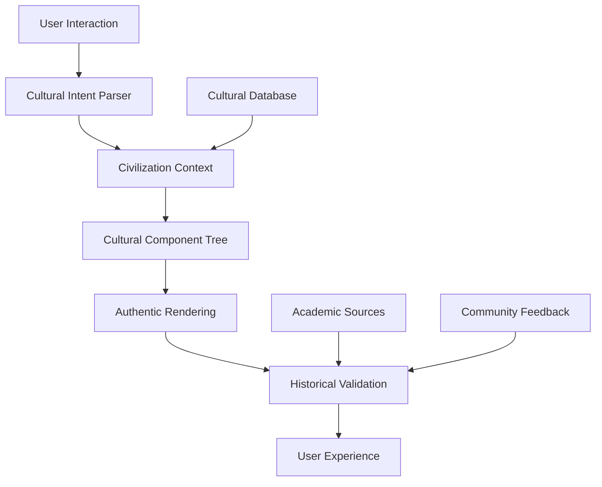

# CHRONOS CULTURALIS
## Documentação Técnica Completa - React Cultural Framework

### 📜 ÍNDICE

1. [Filosofia Técnica](#1-filosofia-técnica)
2. [Arquitetura Cultural](#2-arquitetura-cultural)
3. [Stack Tecnológico](#3-stack-tecnológico)
4. [Terminologia Erudita](#4-terminologia-erudita)
5. [Sistema de Componentes](#5-sistema-de-componentes)
6. [Gestão de Estado Cultural](#6-gestão-de-estado-cultural)
7. [Framework de UI Cultural](#7-framework-de-ui-cultural)
8. [Sistema de Animações](#8-sistema-de-animações)
9. [Testes de Autenticidade](#9-testes-de-autenticidade)
10. [Estratégia de Migração](#10-estratégia-de-migração)
11. [Guias de Implementação](#11-guias-de-implementação)
12. [API Reference](#12-api-reference)

---

## 1. FILOSOFIA TÉCNICA

### 1.1 Manifesto Cultural-Tecnológico

**CHRONOS CULTURALIS** transcende o conceito tradicional de videojogo, estabelecendo-se como **opus cultural interativa** dedicada à preservação, celebração e transmissão de patrimônio civilizacional através de tecnologia React.

#### Princípios Fundamentais:

**1.1.1 Dignitas Technologica**
- Toda decisão técnica deve honrar a complexidade cultural representada
- Código como literatura: legível, elegante, documentado
- Performance como respeito ao usuário e à cultura

**1.1.2 Authenticity First**
- Zero tolerância para estereótipos ou representações superficiais
- Research acadêmico como fundamento de toda implementação
- Validação com especialistas antes de qualquer release

**1.1.3 Modularitas Culturalis**
- Cada civilização como sistema independente e completo
- Reutilização inteligente sem perda de especificidade
- Expansibilidade infinita através de plugins culturais

### 1.2 React como Instrumento Civilizacional

React foi escolhido não apenas por suas capacidades técnicas, mas por sua **filosofia arquitetural** que espelha nossa abordagem cultural:

```jsx
// Exemplo paradigmático: Civilização como Componente
const Civilization = {
  identity: "imperium-nipponense",
  epoch: "heian-jidai",
  
  // Componente = Civilização Encapsulada
  Component: ({ children, ...culturalProps }

### 10.3 Sistema de Migração de Dados

```typescript
// Interface para migração de dados entre plataformas
interface DataMigrationSystem {
  exportGameData(format: 'json' | 'binary' | 'cloud'): Promise<ExportedData>;
  importGameData(data: ExportedData, targetPlatform: PlatformType): Promise<GameState>;
  validateDataIntegrity(data: ExportedData): ValidationResult;
  migrateToVersion(data: ExportedData, targetVersion: string): ExportedData;
}

interface ExportedData {
  version: string;
  timestamp: Date;
  platform: PlatformType;
  gameState: GameState;
  culturalProgress: CulturalProgress;
  userPreferences: UserPreferences;
  achievements: Achievement[];
  metadata: ExportMetadata;
}

export class CrossPlatformDataMigrator implements DataMigrationSystem {
  private readonly CURRENT_VERSION = '1.0.0';
  
  async exportGameData(format: 'json' | 'binary' | 'cloud' = 'json'): Promise<ExportedData> {
    const gameEngine = ChronosCulturalisGameEngine.getInstance();
    const currentState = gameEngine.getCurrentState();
    const culturalProgress = gameEngine.getCulturalProgress();
    
    const exportData: ExportedData = {
      version: this.CURRENT_VERSION,
      timestamp: new Date(),
      platform: this.getCurrentPlatform(),
      gameState: currentState,
      culturalProgress,
      userPreferences: await this.getUserPreferences(),
      achievements: await this.getAchievements(),
      metadata: {
        totalPlayTime: await this.getTotalPlayTime(),
        culturesUnlocked: culturalProgress.unlockedCultures.length,
        lastPlayed: new Date()
      }
    };
    
    switch (format) {
      case 'json':
        return exportData;
      
      case 'binary':
        return await this.compressToBinary(exportData);
      
      case 'cloud':
        return await this.uploadToCloud(exportData);
      
      default:
        return exportData;
    }
  }
  
  async importGameData(data: ExportedData, targetPlatform: PlatformType): Promise<GameState> {
    // Validar integridade dos dados
    const validation = this.validateDataIntegrity(data);
    if (!validation.isValid) {
      throw new Error(`Data integrity validation failed: ${validation.errors.join(', ')}`);
    }
    
    // Migrar para versão atual se necessário
    const migratedData = this.migrateToVersion(data, this.CURRENT_VERSION);
    
    // Adaptar dados para plataforma alvo
    const adaptedData = await this.adaptForPlatform(migratedData, targetPlatform);
    
    // Aplicar configurações específicas da plataforma
    const platformOptimizedState = this.optimizeForPlatform(adaptedData.gameState, targetPlatform);
    
    return platformOptimizedState;
  }
  
  validateDataIntegrity(data: ExportedData): ValidationResult {
    const errors: string[] = [];
    
    // Validar estrutura básica
    if (!data.version) errors.push('Missing version information');
    if (!data.gameState) errors.push('Missing game state');
    if (!data.culturalProgress) errors.push('Missing cultural progress');
    
    // Validar consistência cultural
    const culturalValidator = new CulturalDataValidator();
    const culturalValidation = culturalValidator.validate(data.culturalProgress);
    if (!culturalValidation.isValid) {
      errors.push(...culturalValidation.errors);
    }
    
    // Validar compatibilidade de versão
    if (!this.isVersionCompatible(data.version)) {
      errors.push(`Incompatible version: ${data.version}`);
    }
    
    return {
      isValid: errors.length === 0,
      errors,
      warnings: []
    };
  }
  
  migrateToVersion(data: ExportedData, targetVersion: string): ExportedData {
    const migrations = this.getMigrationChain(data.version, targetVersion);
    
    let migratedData = { ...data };
    
    for (const migration of migrations) {
      migratedData = migration.apply(migratedData);
    }
    
    migratedData.version = targetVersion;
    return migratedData;
  }
  
  private async adaptForPlatform(data: ExportedData, platform: PlatformType): Promise<ExportedData> {
    switch (platform) {
      case 'mobile':
        return {
          ...data,
          userPreferences: {
            ...data.userPreferences,
            graphicsQuality: 'medium', // Mobile optimization
            animationsEnabled: true,
            particleCount: Math.min(data.userPreferences.particleCount || 50, 25)
          }
        };
      
      case 'desktop':
        return {
          ...data,
          userPreferences: {
            ...data.userPreferences,
            graphicsQuality: 'high',
            animationsEnabled: true,
            particleCount: Math.max(data.userPreferences.particleCount || 50, 100)
          }
        };
      
      case 'web':
      default:
        return data;
    }
  }
}
```

### 10.4 Roadmap de Migração Detalhado

```typescript
// Cronograma de desenvolvimento multi-plataforma
export const MIGRATION_ROADMAP = {
  'Phase 1: Web Foundation': {
    duration: '4 meses',
    technologies: ['React', 'TypeScript', 'Vite', 'Tailwind CSS'],
    deliverables: [
      'Core game engine (platform-agnostic)',
      'Cultural UI framework completo',
      'Sistema de validação cultural',
      '3 civilizações implementadas (Nippon, Sinensis, Aegyptus)',
      'Sistema de progressão cultural',
      'Framework de testes de autenticidade'
    ],
    
    milestones: {
      'Month 1': [
        'Setup projeto React + TypeScript',
        'Implementação da arquitetura base',
        'Core cultural engine',
        'Primeiro protótipo interface japonesa'
      ],
      'Month 2': [
        'Sistema completo de temas culturais',
        'Implementação da civilização chinesa',
        'Sistema de animações culturais',
        'Testes de autenticidade básicos'
      ],
      'Month 3': [
        'Implementação da civilização egípcia',
        'Sistema de batalha cultural',
        'Progressão e achievements',
        'Sistema de áudio cultural'
      ],
      'Month 4': [
        'Polish e otimização',
        'Sistema completo de validação',
        'Beta testing com consultores culturais',
        'Preparação para migração mobile'
      ]
    }
  },
  
  'Phase 2: Mobile Migration': {
    duration: '3 meses',
    technologies: ['React Native', 'Expo', 'Native modules'],
    prerequisites: ['Web version estável', 'Core engine testado'],
    
    deliverables: [
      'Aplicação React Native funcional',
      'Adaptadores mobile para cultural UI',
      'Otimizações de performance mobile',
      'Sistema de sincronização de dados',
      'Publicação nas app stores'
    ],
    
    riskMitigation: [
      'Manter core logic inalterado',
      'Testes extensivos em devices reais',
      'Fallbacks para funcionalidades não suportadas',
      'Sistema robusto de migração de dados'
    ]
  },
  
  'Phase 3: Desktop Enhancement': {
    duration: '2 meses',
    technologies: ['Electron', 'Native APIs', 'Auto-updater'],
    
    deliverables: [
      'Aplicação desktop (Windows/Mac/Linux)',
      'Funcionalidades desktop-específicas',
      'Melhor performance para hardware potente',
      'Sistema de distribuição multiplataforma'
    ],
    
    enhancements: [
      'Maior resolução de assets culturais',
      'Efeitos visuais avançados',
      'Suporte para múltiplos monitores',
      'Integração com sistema operacional'
    ]
  }
};

// Métricas de sucesso para cada fase
export const SUCCESS_METRICS = {
  'Phase 1 (Web)': {
    technical: [
      'Performance: 60fps em animações culturais',
      'Loading time: <3s para mudança de civilização',
      'Bundle size: <2MB para assets core',
      'Accessibility: WCAG 2.1 AA compliance'
    ],
    cultural: [
      'Validação cultural: >95% accuracy score',
      'Feedback de especialistas: >4.5/5',
      'Representação autêntica de 3 civilizações',
      'Zero uso de estereótipos culturais'
    ],
    user: [
      'User engagement: >20min sessão média',
      'Cultural learning: testes pré/pós mostram +40% conhecimento',
      'Satisfaction: >4.2/5 user rating',
      'Retention: >60% usuários retornam em 7 dias'
    ]
  },
  
  'Phase 2 (Mobile)': {
    technical: [
      'Performance: 30fps mínimo em devices mid-range',
      'Battery usage: <5% drain por hora de jogo',
      'App size: <100MB download inicial',
      'Crash rate: <0.1%'
    ],
    migration: [
      'Data migration success rate: >99%',
      'Feature parity com web: >95%',
      'Platform-specific optimizations: implementadas'
    ]
  },
  
  'Phase 3 (Desktop)': {
    technical: [
      'Performance: 60fps+ em hardware moderno',
      'Memory usage: <500MB RAM',
      'Startup time: <5s',
      'Cross-platform compatibility: Windows/Mac/Linux'
    ],
    enhancement: [
      'Visual quality: 4K textures support',
      'Advanced effects: particle systems, shaders',
      'Multi-monitor support: implementado'
    ]
  }
};
```

---

## 11. GUIAS DE IMPLEMENTAÇÃO

### 11.1 Quick Start Guide

```bash
# 1. Setup inicial do projeto
git clone https://github.com/your-org/chronos-culturalis-web.git
cd chronos-culturalis-web

# 2. Instalação de dependências
npm install

# 3. Setup do ambiente de desenvolvimento
cp .env.example .env.local
npm run dev

# 4. Verificar instalação
npm run test
npm run build
```

### 11.2 Desenvolvimento de Nova Civilização

```typescript
// Guia step-by-step para adicionar nova civilização

// 1. Definir tipos TypeScript
interface NovaCivilitas extends CivilizationType {
  readonly identity: 'aegyptus';
  readonly displayName: 'Aegyptus Antiqua';
  readonly availableEpochs: ['old-kingdom', 'middle-kingdom', 'new-kingdom'];
}

// 2. Criar schema cultural
const schemaAegyptiacum: CulturalTheme = {
  identity: {
    civilitas: 'aegyptus',
    epocha: 'new-kingdom',
    nomen: 'New Kingdom Egyptian Aesthetics'
  },
  
  chromata: {
    primary: '#DAA520',    // Dourado faraônico
    secondary: '#4169E1',  // Azul lapis lazuli  
    accent: '#8B0000',     // Vermelho terra
    background: '#F5DEB3', // Arenito do deserto
    // ... mais cores históricas
  },
  
  // ... resto do schema
};

// 3. Implementar componentes específicos
const BarraVitalisAegyptiaca: FC<BarraVitalisProps> = (props) => {
  const theme = useCivilitasThematica('aegyptus');
  
  return (
    <div className="barra-vitalis aegyptiaca" style={theme.barraStyle}>
      <AnkhIcon />
      <HieroglyphText text={`${props.vitalis}/${props.maxVitalis}`} />
      <ScarabDecoration />
    </div>
  );
};

// 4. Adicionar ao registro cultural
const culturalRegistry = new CulturalRegistry();
culturalRegistry.register('aegyptus', {
  theme: schemaAegyptiacum,
  components: {
    BarraVitalis: BarraVitalisAegyptiaca,
    PersonaCard: PersonaAegyptiaca,
    SkillSystem: SystemaHieroglyphicum
  },
  validators: [aegyptianHistoricalValidator],
  assets: aegyptianAssetPack
});

// 5. Criar testes de autenticidade
describe('Aegyptus Cultural Authenticity', () => {
  test('Hieróglifos seguem períodos históricos corretos', () => {
    const hieroglyphs = ['ankh', 'was-scepter', 'djed-pillar'];
    
    hieroglyphs.forEach(symbol => {
      const validation = validateEgyptianSymbol(symbol, 'new-kingdom');
      expect(validation.isHistoricallyAccurate).toBe(true);
    });
  });
  
  test('Paleta de cores reflete pigmentos disponíveis no período', () => {
    const colors = schemaAegyptiacum.chromata;
    const period = 'new-kingdom';
    
    Object.values(colors).forEach(color => {
      const pigmentValidation = validateEgyptianPigment(color, period);
      expect(pigmentValidation.wasAvailable).toBe(true);
    });
  });
});

// 6. Documentar research acadêmico
/**
 * SOURCES FOR AEGYPTUS IMPLEMENTATION:
 * 
 * - "Art and Architecture of Ancient Egypt" by W. Stevenson Smith
 * - "Egyptian Art in the Age of the Pyramids" by Metropolitan Museum
 * - "Color and Meaning: Art, Science, and Symbolism" by John Gage
 * - Consultoria: Dr. Sarah Hassan, Egyptology Department, Cairo University
 * 
 * CULTURAL CONSULTANTS:
 * - Egyptian Museum, Cairo
 * - Oriental Institute, University of Chicago
 * - Egypt Community Cultural Center
 */
```

### 11.3 Guidelines de Contribuição Cultural

```markdown
# Cultural Contribution Guidelines

## Antes de Contribuir

1. **Research Acadêmico Obrigatório**
   - Mínimo 3 fontes acadêmicas peer-reviewed
   - Consulta com especialistas da área
   - Validação com comunidades culturais relevantes

2. **Documentação Completa**
   - Fontes históricas citadas
   - Contexto temporal específico
   - Justificativa para escolhas estéticas

3. **Testes de Autenticidade**
   - Implementar validadores específicos
   - Testes unitários para precisão histórica
   - Review com cultural advisory board

## Processo de Contribuição

### 1. Pesquisa e Planejamento
```typescript
// Template para nova civilização
const novaCivilizacao = {
  research: {
    academicSources: [
      // Mínimo 3 fontes acadêmicas
    ],
    culturalConsultants: [
      // Especialistas contactados
    ],
    communityFeedback: [
      // Feedback de comunidades relevantes  
    ]
  },
  
  implementation: {
    historicalPeriod: '', // Específico, ex: "Heian Period (794-1185)"
    geographicRegion: '', // Ex: "Imperial Court, Kyoto"
    socialContext: '',    // Ex: "Aristocratic class"
    religiousContext: ''  // Ex: "Buddhist-Shinto syncretism"
  }
};
```

### 2. Implementação Técnica
- Seguir patterns estabelecidos
- Usar terminologia culturalmente apropriada  
- Implementar testes de autenticidade
- Documentar decisões de design

### 3. Review Process
1. **Technical Review** - Código e arquitetura
2. **Cultural Review** - Autenticidade e respeito
3. **Academic Review** - Precisão histórica
4. **Community Review** - Feedback cultural

### 4. Critérios de Aprovação
- [ ] Sources acadêmicas validadas
- [ ] Feedback positivo de especialistas
- [ ] Testes de autenticidade passando
- [ ] Zero uso de estereótipos
- [ ] Documentação completa
- [ ] Performance adequada

## Cultural Red Flags

❌ **Nunca Fazer:**
- Usar símbolos sagrados como decoração
- Misturar elementos de épocas diferentes
- Perpetuar estereótipos culturais
- Ignorar contexto social/religioso
- Copiar elementos sem research

✅ **Sempre Fazer:**
- Research extensivo antes da implementação
- Consultar especialistas da área
- Respeitar sensibilidades culturais
- Documentar fontes e decisões
- Validar com comunidades relevantes
```

---

## 12. API REFERENCE

### 12.1 Core Cultural API

```typescript
// API principal do sistema cultural
export namespace CulturalAPI {
  
  // Tipos base
  export type CivilizationType = 'nippon' | 'sinensis' | 'aegyptus' | string;
  export type EpochType = string;
  export type ValidationLevel = 'strict' | 'moderate' | 'permissive';
  
  // Interfaces principais
  export interface CulturalContext {
    readonly civilitas: CivilizationType;
    readonly epocha: EpochType;
    readonly region?: string;
    readonly socialClass?: string;
    readonly religiousContext?: string;
  }
  
  export interface CulturalTheme {
    readonly identity: ThemeIdentity;
    readonly chromata: ColorPalette;
    readonly typography: TypographySystem;
    readonly formae: ShapeSystem;
    readonly components: ComponentThemes;
    readonly animations: AnimationSystem;
  }
  
  export interface ValidationResult {
    readonly isAuthentic: boolean;
    readonly confidenceScore: number;
    readonly issues: ValidationIssue[];
    readonly recommendations: string[];
    readonly sources: AcademicSource[];
  }
  
  // Classes principais
  export class CulturalRegistry {
    /**
     * Registra uma nova civilização no sistema
     * @param civilitas - Identificador da civilização
     * @param config - Configuração cultural completa
     */
    register(civilitas: CivilizationType, config: CivilizationConfig): void;
    
    /**
     * Obtém configuração cultural
     * @param civilitas - Civilização desejada
     * @param epocha - Época específica (opcional)
     */
    getCivilization(civilitas: CivilizationType, epocha?: EpochType): CivilizationConfig;
    
    /**
     * Lista todas as civilizações disponíveis
     */
    getAvailableCivilizations(): CivilizationType[];
    
    /**
     * Valida se uma civilização está registrada
     */
    isRegistered(civilitas: CivilizationType): boolean;
  }
  
  export class CulturalValidator {
    constructor(sources?: AcademicSource[], level?: ValidationLevel);
    
    /**
     * Valida autenticidade cultural de um elemento
     * @param element - Elemento a ser validado
     * @param context - Contexto cultural
     */
    validate(element: any, context: CulturalContext): ValidationResult;
    
    /**
     * Valida cores históricas
     */
    validateColors(colors: Record<string, string>, context: CulturalContext): ValidationResult;
    
    /**
     * Valida formas tradicionais
     */
    validateShapes(shapes: string[], context: CulturalContext): ValidationResult;
    
    /**
     * Valida símbolos culturais
     */
    validateSymbols(symbols: string[], context: CulturalContext): ValidationResult;
  }
  
  // Hooks React
  export function useCivilitasThematica(
    civilitas: CivilizationType, 
    epocha?: EpochType
  ): {
    theme: CulturalTheme;
    loading: boolean;
    error: Error | null;
  };
  
  export function useAnimationesTraditionales(
    civilitas: CivilizationType
  ): {
    motus: AnimationLibrary;
    playSpecial: (animationType: string) => void;
  };
  
  export function useAuthenticitas(
    validationLevel?: ValidationLevel
  ): {
    validate: (element: any, context: CulturalContext) => ValidationResult;
    level: ValidationLevel;
    setLevel: (level: ValidationLevel) => void;
  };
  
  export function useCulturalProgress(
    civilitas: CivilizationType
  ): {
    level: number;
    artifacts: string[];
    achievements: Achievement[];
    increaseSapientia: (amount: number) => void;
    collectArtifact: (artifact: string) => void;
  };
  
  // Componentes React
  export const CulturalProvider: FC<{
    children: ReactNode;
    defaultCivilization?: CivilizationType;
    validationLevel?: ValidationLevel;
    sources?: AcademicSource[];
  }>;
  
  export const PersonaCulturalis: FC<{
    nomen: string;
    civilitas: CivilizationType;
    epocha?: EpochType;
    attributa: PersonaAttributes;
    effigies?: string;
    className?: string;
  }>;
  
  export const BarraVitalisCulturalis: FC<{
    vitalis: number;
    maximumVitalis: number;
    civilitas: CivilizationType;
    epocha?: EpochType;
    animationsEnabled?: boolean;
  }>;
  
  export const CulturalThemeProvider: FC<{
    children: ReactNode;
    theme: CulturalTheme;
    validationEnabled?: boolean;
  }>;
  
  // Utilitários
  export namespace Utils {
    /**
     * Gera paleta de cores baseada em pigmentos históricos
     */
    export function generateHistoricalPalette(
      civilitas: CivilizationType, 
      epocha: EpochType
    ): ColorPalette;
    
    /**
     * Converte nomenclatura cultural para display names
     */
    export function formatCulturalName(
      civilitas: CivilizationType, 
      locale?: string
    ): string;
    
    /**
     * Valida compatibilidade entre civilizações para interações
     */
    export function checkCulturalCompatibility(
      civ1: CivilizationType, 
      civ2: CivilizationType,
      context: 'battle' | 'trade' | 'diplomacy'
    ): CompatibilityResult;
    
    /**
     * Extrai insights culturais de ações do jogador
     */
    export function extractCulturalInsights(
      actions: GameAction[],
      context: CulturalContext
    ): CulturalInsight[];
  }
  
  // Constantes
  export const SUPPORTED_CIVILIZATIONS: readonly CivilizationType[];
  export const DEFAULT_VALIDATION_LEVEL: ValidationLevel = 'strict';
  export const CULTURAL_TRANSITIONS: Record<string, TransitionConfig>;
}
```

### 12.2 Eventos e Listeners

```typescript
// Sistema de eventos culturais
export namespace CulturalEvents {
  
  export interface CulturalEventMap {
    'civilization:changed': { 
      from: CivilizationType; 
      to: CivilizationType; 
      epoch: EpochType; 
    };
    
    'cultural:discovery': { 
      civilitas: CivilizationType; 
      artifact: string; 
      significance: number; 
    };
    
    'validation:failed': { 
      element: string; 
      context: CulturalContext; 
      issues: ValidationIssue[]; 
    };
    
    'theme:applied': { 
      civilitas: CivilizationType; 
      theme: CulturalTheme; 
    };
    
    'progression:updated': { 
      civilitas: CivilizationType; 
      newLevel: number; 
      achievements: Achievement[]; 
    };
  }
  
  export class CulturalEventEmitter {
    /**
     * Registra listener para eventos culturais
     */
    on<K extends keyof CulturalEventMap>(
      event: K, 
      listener: (data: CulturalEventMap[K]) => void
    ): void;
    
    /**
     * Remove listener
     */
    off<K extends keyof CulturalEventMap>(
      event: K, 
      listener: (data: CulturalEventMap[K]) => void
    ): void;
    
    /**
     * Emite evento cultural
     */
    emit<K extends keyof CulturalEventMap>(
      event: K, 
      data: CulturalEventMap[K]
    ): void;
    
    /**
     * Listener único (remove após primeira execução)
     */
    once<K extends keyof CulturalEventMap>(
      event: K, 
      listener: (data: CulturalEventMap[K]) => void
    ): void;
  }
  
  // Hook para eventos culturais
  export function useCulturalEvents(): CulturalEventEmitter;
  
  // Hook para evento específico
  export function useCulturalEvent<K extends keyof CulturalEventMap>(
    event: K, 
    handler: (data: CulturalEventMap[K]) => void
  ): void;
}
```

---

## 📚 CONSIDERAÇÕES FINAIS

### Filosofia de Desenvolvimento Contínuo

**CHRONOS CULTURALIS** representa mais que um projeto técnico - é um **manifesto cultural**. A documentação aqui apresentada serve como **fundação viva** que evoluirá junto com nosso conhecimento e com as contribuições da comunidade acadêmica e cultural global.

### Responsabilidade Cultural

Cada linha de código, cada componente React, cada validação de autenticidade carrega a responsabilidade de **preservar e honrar** o patrimônio civilizacional humano. Esta documentação técnica é também um **compromisso ético**.

### Evolução Tecnológica e Cultural

As tecnologias mudam, mas o **respeito pela diversidade cultural** permanece constante. Esta arquitetura React foi projetada para **transcender frameworks**, permitindo que a essência cultural migre através de qualquer tecnologia futura.

### Chamado à Comunidade

Esta documentação é um **convite aberto** para:
- **Desenvolvedores** que desejam revolucionar a representação cultural em games
- **Académicos** que podem contribuir com research autêntico
- **Comunidades culturais** que desejam ver suas heranças honradas digitalmente
- **Jogadores** que buscam experiências culturais genuínas

**Per Aspera ad Astra Culturalis** - Através das dificuldades técnicas, às estrelas culturais.

---

*"O código mais belo é aquele que preserva a alma de uma civilização para as gerações futuras."*

**- Manifesto CHRONOS CULTURALIS**) => (
    <CulturalProvider civilization="nippon" epoch="heian">
      <ThemeProvider theme={heianAesthetics}>
        <AnimationProvider motions={sumieBrushwork}>
          {children}
        </AnimationProvider>
      </ThemeProvider>
    </CulturalProvider>
  )
};
```

---

## 2. ARQUITETURA CULTURAL

### 2.1 Estrutura Hierárquica

```
CHRONOS CULTURALIS Architecture
├── Core Cultural Engine
│   ├── Civilization Registry
│   ├── Cultural Validation System
│   ├── Heritage Authentication
│   └── Cross-Cultural Bridge
│
├── React Application Layer
│   ├── Cultural Components
│   ├── Interactive Systems
│   ├── Animation Engine
│   └── State Management
│
├── Platform Adapters
│   ├── Web Interface
│   ├── Mobile Bridge (Future)
│   └── Desktop Wrapper (Future)
│
└── Cultural Assets
    ├── Historical Resources
    ├── Authentic Media
    ├── Academic References
    └── Community Contributions
```

### 2.2 Fluxo de Dados Culturais



---

## 3. STACK TECNOLÓGICO

### 3.1 Tecnologias Principais

#### 3.1.1 Core Framework
```json
{
  "react": "^18.2.0",
  "typescript": "^5.2.0",
  "vite": "^4.4.0"
}
```

#### 3.1.2 State Management
```json
{
  "zustand": "^4.4.0",
  "@tanstack/react-query": "^4.32.0"
}
```

#### 3.1.3 UI & Styling
```json
{
  "tailwindcss": "^3.3.0",
  "framer-motion": "^10.16.0",
  "styled-components": "^6.0.7",
  "@radix-ui/react-primitive": "^1.0.0"
}
```

#### 3.1.4 Cultural Assets
```json
{
  "tone": "^14.7.77",
  "canvas-sketch": "^0.7.7",
  "three": "^0.155.0",
  "@react-three/fiber": "^8.13.0"
}
```

#### 3.1.5 Development Tools
```json
{
  "@testing-library/react": "^13.4.0",
  "@storybook/react": "^7.4.0",
  "vitest": "^0.34.0",
  "eslint-plugin-cultural-authenticity": "custom"
}
```

### 3.2 Estrutura de Projeto

```
chronos-culturalis/
├── docs/                           # Documentação completa
│   ├── cultural-research/          # Research acadêmico
│   ├── api-reference/             # API documentation
│   ├── migration-guides/          # Guias de migração
│   └── design-philosophy/         # Filosofia de design
│
├── packages/                      # Monorepo structure
│   ├── core-cultural-engine/     # Engine principal
│   ├── react-cultural-ui/        # Componentes React
│   ├── cultural-validation/      # Validação de autenticidade
│   ├── civilization-registry/    # Registro de civilizações
│   └── shared-utilities/         # Utilitários compartilhados
│
├── apps/
│   ├── web/                      # Aplicação React Web
│   ├── storybook/               # Component showcase
│   ├── documentation/           # Documentation site
│   └── cultural-validator/      # Ferramenta de validação
│
├── cultural-assets/
│   ├── nippon/                  # Assets japoneses
│   │   ├── heian-period/
│   │   ├── edo-period/
│   │   └── meiji-restoration/
│   ├── sinensis/                # Assets chineses
│   │   ├── tang-dynasty/
│   │   ├── song-dynasty/
│   │   └── ming-dynasty/
│   └── aegyptus/               # Assets egípcios
│       ├── old-kingdom/
│       ├── middle-kingdom/
│       └── new-kingdom/
│
├── research/                   # Research acadêmico
│   ├── historical-sources/
│   ├── archaeological-data/
│   ├── cultural-consultations/
│   └── authenticity-validation/
│
└── tools/
    ├── cultural-asset-pipeline/
    ├── theme-generator/
    ├── migration-tools/
    └── validation-scripts/
```

---

## 4. TERMINOLOGIA ERUDITA

### 4.1 Vocabularium Technicum Fundamentale

#### 4.1.1 Estruturas Básicas
- **`Civilitas`** - Interface base para qualquer civilização
- **`Patrimonium`** - Heritage cultural de uma civilização  
- **`Persona`** - Character/Personagem com background cultural
- **`Attributum`** - Atributo ou característica cultural
- **`Sapientia`** - Sistema de conhecimento/sabedoria cultural
- **`Aesthetica`** - Schema visual de uma cultura específica

#### 4.1.2 Elementos Visuais
- **`Schema`** - Theme/esquema visual completo
- **`Chromata`** - Sistema de cores históricamente precisas
- **`Formae`** - Formas e shapes culturais autênticas
- **`Texturae`** - Texturas tradicionais e materiais
- **`Decorationes`** - Elementos decorativos específicos
- **`Iconographia`** - Sistema iconográfico completo
- **`Symbola`** - Símbolos culturais com significado

#### 4.1.3 Elementos Interativos
- **`Motus`** - Animações e movimentos culturais
- **`Transitio`** - Transições entre estados/telas
- **`Effectus`** - Efeitos visuais culturalmente apropriados
- **`Sonus`** - Sistema de audio tradicional
- **`Tactus`** - Interações touch/mouse culturalmente contextualizadas

#### 4.1.4 Estados e Lógica
- **`Status`** - Estado atual do sistema cultural
- **`Progressus`** - Sistema de progressão cultural
- **`Transformatio`** - Mudanças de estado cultural
- **`Validatio`** - Processo de validação de autenticidade
- **`Migrationis`** - Sistema de migração entre plataformas

### 4.2 Convenções de Nomenclatura

#### 4.2.1 Componentes React
```jsx
// Padrão: [Tipo][Função]Culturalis
const PersonaCulturalis = () => {};
const BarraVitalisCulturalis = () => {};
const InterfaciumBattleCulturalis = () => {};

// Para civilizações específicas: [Elemento][Civilização]
const PersonaNipponica = () => {};
const BarraVitalisSinensis = () => {};
const InterfaciumAegyptiacum = () => {};
```

#### 4.2.2 Hooks Customizados
```jsx
// Padrão: use[Função]Culturalis
const useCivilitasThematica = () => {};
const useAnimationesTraditionales = () => {};
const useSapientiaProgression = () => {};
const useAuthenticitas = () => {};
```

#### 4.2.3 Utilitários
```jsx
// Padrão: [função][Contexto]Culturale
const validateHistoricalAccuracy = () => {};
const generateCulturalPalette = () => {};
const parseCivilizationData = () => {};
const authenticateSource = () => {};
```

---

## 5. SISTEMA DE COMPONENTES

### 5.1 Hierarquia de Componentes Culturais

```jsx
// Provedor Cultural Raiz
<CulturalProvider>
  <CivilizationProvider civilization="nippon" epoch="heian">
    <ThemeProvider theme={heianAesthetics}>
      <GameProvider>
        
        {/* Interface Principal */}
        <InterfaciumPrincipale>
          
          {/* Área de Jogo */}
          <AreaLudicus>
            <PersonaCulturalis culture="nippon" />
            <BarraVitalisCulturalis />
            <SystemaSkillorum />
          </AreaLudicus>
          
          {/* Menu Cultural */}
          <MenuCulturale>
            <SelectorCivilization />
            <MuseumMode />
            <SettingsCulturales />
          </MenuCulturale>
          
        </InterfaciumPrincipale>
        
      </GameProvider>
    </ThemeProvider>
  </CivilizationProvider>
</CulturalProvider>
```

### 5.2 Componentes Base

#### 5.2.1 CulturalProvider

```typescript
interface CulturalProviderProps {
  children: ReactNode;
  defaultCivilization?: CivilizationType;
  validationLevel?: 'strict' | 'moderate' | 'permissive';
  academicSources?: AcademicSource[];
}

const CulturalProvider: FC<CulturalProviderProps> = ({
  children,
  defaultCivilization = 'nippon',
  validationLevel = 'strict',
  academicSources = []
}) => {
  const [culturalRegistry] = useState(
    () => new CulturalRegistrySystem(academicSources)
  );
  
  const [currentCivilization, setCivilization] = useState(defaultCivilization);
  
  return (
    <CulturalContext.Provider 
      value={{
        registry: culturalRegistry,
        current: currentCivilization,
        setCivilization,
        validationLevel
      }}
    >
      {children}
    </CulturalContext.Provider>
  );
};
```

#### 5.2.2 PersonaCulturalis

```typescript
interface PersonaCulturalisProps {
  nomen: string;
  civilitas: CivilizationType;
  epoch?: EpochType;
  attributa: PersonaAttributes;
  effigies?: string;
  className?: string;
}

const PersonaCulturalis: FC<PersonaCulturalisProps> = ({
  nomen,
  civilitas,
  epoch,
  attributa,
  effigies,
  className
}) => {
  const { theme } = useCivilitasThematica(civilitas, epoch);
  const animations = useAnimationesTraditionales(civilitas);
  
  return (
    <motion.article
      className={cn("persona-culturalis", className)}
      style={theme.personaContainer}
      variants={animations.entrance}
      initial="hidden"
      animate="visible"
    >
      <header className="nomenclatura">
        <h2 className="nomen-proprium">{nomen}</h2>
        <div className="civilitas-indicator">
          <CivilitasIcon type={civilitas} epoch={epoch} />
        </div>
      </header>
      
      <section className="effigies-container">
        {effigies && (
          
        )}
      </section>
      
      <footer className="attributa-display">
        <AttributaRenderer 
          attributa={attributa}
          culturalStyle={theme.attributaStyle}
        />
      </footer>
    </motion.article>
  );
};
```

#### 5.2.3 BarraVitalisCulturalis

```typescript
interface BarraVitalisProps {
  vitalis: number;
  maximumVitalis: number;
  civilitas: CivilizationType;
  epoch?: EpochType;
  animationsEnabled?: boolean;
}

const BarraVitalisCulturalis: FC<BarraVitalisProps> = ({
  vitalis,
  maximumVitalis,
  civilitas,
  epoch,
  animationsEnabled = true
}) => {
  const { schema } = useCivilitasThematica(civilitas, epoch);
  const { motus } = useAnimationesTraditionales(civilitas);
  
  const percentage = (vitalis / maximumVitalis) * 100;
  
  return (
    <div 
      className="barra-vitalis-container"
      style={schema.vitalisContainer}
    >
      <div 
        className="barra-background"
        style={schema.vitalisBackground}
      />
      
      <motion.div
        className="barra-fill"
        style={{
          ...schema.vitalisFill,
          width: `${percentage}%`
        }}
        animate={animationsEnabled ? motus.vitalisFlow : {}}
        transition={{ duration: 0.5, ease: "easeInOut" }}
      />
      
      <div 
        className="barra-decorations"
        style={schema.vitalisDecorations}
      >
        <DecorationesRenderer 
          type={schema.decorationType}
          culturalStyle={schema.decorationStyle}
        />
      </div>
      
      <span className="vitalis-numerus">
        {vitalis} / {maximumVitalis}
      </span>
    </div>
  );
};
```

### 5.3 Componentes Especializados por Civilização

#### 5.3.1 Componentes Nipponenses

```typescript
// Barra Vitalis no estilo Torii
const BarraVitalisNipponica: FC<BarraVitalisProps> = (props) => {
  return (
    <BarraVitalisCulturalis
      {...props}
      civilitas="nippon"
      customShape="torii"
      decorativeElements={["sakura", "knotwork", "kanji"]}
    />
  );
};

// Interface de Habilidades estilo Shoji
const SystemaSkillorumNipponicum: FC<SkillSystemProps> = ({
  skills,
  activeSkill,
  onSkillSelect
}) => {
  const theme = useCivilitasThematica("nippon");
  
  return (
    <div className="skills-container shoji-style">
      {skills.map(skill => (
        <motion.div
          key={skill.id}
          className="skill-panel"
          style={theme.shojiPanel}
          whileHover={theme.animations.shojiOpen}
          onClick={() => onSkillSelect(skill)}
        >
          <div className="skill-icon">
            <KanjiIcon character={skill.kanjiRepresentation} />
          </div>
          <div className="skill-name">{skill.nomen}</div>
        </motion.div>
      ))}
    </div>
  );
};
```

#### 5.3.2 Componentes Sinenses

```typescript
// Barra Vitalis estilo Ruyi
const BarraVitalisSinensis: FC<BarraVitalisProps> = (props) => {
  return (
    <BarraVitalisCulturalis
      {...props}
      civilitas="sinensis"
      customShape="ruyi"
      decorativeElements={["dragons", "clouds", "jade"]}
    />
  );
};

// Sistema de Elementos (Wu Xing)
const SystemaWuXing: FC<ElementSystemProps> = ({ elements, balance }) => {
  const theme = useCivilitasThematica("sinensis");
  
  return (
    <div className="wu-xing-container">
      {elements.map((element, index) => (
        <motion.div
          key={element.type}
          className={`element-${element.type}`}
          style={theme.wuXingElements[element.type]}
          animate={{
            scale: balance[element.type] > 0.8 ? 1.1 : 1.0,
            opacity: balance[element.type]
          }}
        >
          <ElementIcon type={element.type} />
          <span className="element-balance">
            {Math.round(balance[element.type] * 100)}%
          </span>
        </motion.div>
      ))}
    </div>
  );
};
```

---

## 6. GESTÃO DE ESTADO CULTURAL

### 6.1 Store Cultural Principal

```typescript
import { create } from 'zustand';
import { persist } from 'zustand/middleware';

interface CulturalState {
  // Estado atual
  civilitasCurrentis: CivilizationType;
  epochaCurrentis: EpochType;
  
  // Civilizações disponíveis
  civilitatesAvailable: CivilizationType[];
  civilitatesUnlocked: CivilizationType[];
  
  // Progressão cultural
  sapientiaLevels: Record<CivilizationType, number>;
  artifactaCollected: Record<CivilizationType, string[]>;
  achievementsUnlocked: Achievement[];
  
  // Configurações
  validationLevel: ValidationLevel;
  audioEnabled: boolean;
  animationsEnabled: boolean;
  
  // Ações
  selectCivilitas: (civilitas: CivilizationType) => void;
  unlockCivilitas: (civilitas: CivilizationType) => void;
  increaseSapientia: (civilitas: CivilizationType, amount: number) => void;
  collectArtifact: (civilitas: CivilizationType, artifact: string) => void;
  toggleValidation: (level: ValidationLevel) => void;
}

const useCulturalStore = create<CulturalState>()(
  persist(
    (set, get) => ({
      // Estado inicial
      civilitasCurrentis: 'nippon',
      epochaCurrentis: 'heian',
      
      civilitatesAvailable: ['nippon', 'sinensis', 'aegyptus'],
      civilitatesUnlocked: ['nippon'],
      
      sapientiaLevels: {
        nippon: 1,
        sinensis: 0,
        aegyptus: 0
      },
      
      artifactaCollected: {
        nippon: [],
        sinensis: [],
        aegyptus: []
      },
      
      achievementsUnlocked: [],
      
      validationLevel: 'strict',
      audioEnabled: true,
      animationsEnabled: true,
      
      // Implementação das ações
      selectCivilitas: (civilitas) => {
        set(state => ({
          civilitasCurrentis: civilitas,
          epochaCurrentis: getDefaultEpoch(civilitas)
        }));
      },
      
      unlockCivilitas: (civilitas) => {
        set(state => ({
          civilitatesUnlocked: [...state.civilitatesUnlocked, civilitas]
        }));
      },
      
      increaseSapientia: (civilitas, amount) => {
        set(state => ({
          sapientiaLevels: {
            ...state.sapientiaLevels,
            [civilitas]: state.sapientiaLevels[civilitas] + amount
          }
        }));
        
        // Check for achievements
        const newLevel = get().sapientiaLevels[civilitas];
        checkSapientiaAchievements(civilitas, newLevel);
      },
      
      collectArtifact: (civilitas, artifact) => {
        set(state => ({
          artifactaCollected: {
            ...state.artifactaCollected,
            [civilitas]: [...state.artifactaCollected[civilitas], artifact]
          }
        }));
      },
      
      toggleValidation: (level) => {
        set({ validationLevel: level });
      }
    }),
    {
      name: 'chronos-cultural-state',
      version: 1
    }
  )
);
```

### 6.2 Hooks de Estado Cultural

```typescript
// Hook para civilização atual
export const useCurrentCivilitas = () => {
  const civilitasCurrentis = useCulturalStore(state => state.civilitasCurrentis);
  const epochaCurrentis = useCulturalStore(state => state.epochaCurrentis);
  const selectCivilitas = useCulturalStore(state => state.selectCivilitas);
  
  return {
    current: civilitasCurrentis,
    epoch: epochaCurrentis,
    select: selectCivilitas
  };
};

// Hook para progressão cultural
export const useSapientiaProgression = (civilitas: CivilizationType) => {
  const level = useCulturalStore(state => state.sapientiaLevels[civilitas]);
  const artifacts = useCulturalStore(state => state.artifactaCollected[civilitas]);
  const increaseSapientia = useCulturalStore(state => state.increaseSapientia);
  const collectArtifact = useCulturalStore(state => state.collectArtifact);
  
  return {
    level,
    artifacts,
    increaseSapientia: (amount: number) => increaseSapientia(civilitas, amount),
    collectArtifact: (artifact: string) => collectArtifact(civilitas, artifact),
    progress: calculateProgressPercentage(level, artifacts.length)
  };
};

// Hook para validação cultural
export const useAuthenticitas = () => {
  const validationLevel = useCulturalStore(state => state.validationLevel);
  const toggleValidation = useCulturalStore(state => state.toggleValidation);
  
  const validateCulturalElement = useCallback((element: any, culture: CivilizationType) => {
    return validateElementAuthenticity(element, culture, validationLevel);
  }, [validationLevel]);
  
  return {
    level: validationLevel,
    toggle: toggleValidation,
    validate: validateCulturalElement
  };
};
```

---

## 7. FRAMEWORK DE UI CULTURAL

### 7.1 Sistema de Temas Culturais

```typescript
// Definição base do tema cultural
interface CulturalTheme {
  identity: {
    civilitas: CivilizationType;
    epocha: EpochType;
    nomen: string;
  };
  
  chromata: {
    primary: string;
    secondary: string;
    accent: string;
    background: string;
    surface: string;
    onSurface: string;
    // Cores específicas da cultura
    [key: string]: string;
  };
  
  typography: {
    fontFamily: string;
    fontSize: {
      small: string;
      medium: string;
      large: string;
      title: string;
    };
    fontWeight: {
      normal: number;
      medium: number;
      bold: number;
    };
  };
  
  formae: {
    borderRadius: string;
    customShapes: Record<string, string>; // clip-path values
  };
  
  spacing: {
    xs: string;
    sm: string;
    md: string;
    lg: string;
    xl: string;
  };
  
  components: {
    barraVitalis: ComponentTheme;
    persona: ComponentTheme;
    button: ComponentTheme;
    card: ComponentTheme;
  };
  
  animations: {
    duration: {
      fast: string;
      medium: string;
      slow: string;
    };
    easing: {
      entrance: string;
      exit: string;
      interaction: string;
    };
  };
}

interface ComponentTheme {
  base: CSSProperties;
  variants: Record<string, CSSProperties>;
  states: {
    hover?: CSSProperties;
    active?: CSSProperties;
    disabled?: CSSProperties;
  };
}
```

### 7.2 Implementação de Temas Específicos

#### 7.2.1 Tema Nipponense (Período Heian)

```typescript
export const themaHeianensis: CulturalTheme = {
  identity: {
    civilitas: 'nippon',
    epocha: 'heian',
    nomen: 'Aesthetic Imperial Heian'
  },
  
  chromata: {
    primary: '#E34234',    // Vermelho cinábrio (shu-iro)
    secondary: '#0D0D0D',  // Negro urushi (urushi-kuro)
    accent: '#FFD700',     // Dourado imperial (kin-iro)
    background: '#F5F5DC', // Papel washi (washi-iro)
    surface: '#FFFFFF',    // Seda branca (kinu-shiro)
    onSurface: '#1C1C1C',  // Negro sumi (sumi-kuro)
    
    // Cores específicas do período Heian
    murasaki: '#9966CC',   // Púrpura aristocrático
    sakura: '#FFB7C5',     // Rosa cerejeira
    matcha: '#C5C56A',     // Verde chá matcha
    indigo: '#4B0082'      // Añil imperial
  },
  
  typography: {
    fontFamily: '"Noto Serif JP", "Yu Mincho", serif',
    fontSize: {
      small: '0.875rem',
      medium: '1rem',
      large: '1.25rem',
      title: '2rem'
    },
    fontWeight: {
      normal: 300,
      medium: 500,
      bold: 700
    }
  },
  
  formae: {
    borderRadius: '0.25rem',
    customShapes: {
      torii: 'polygon(10% 0%, 90% 0%, 90% 15%, 85% 15%, 85% 100%, 15% 100%, 15% 15%, 10% 15%)',
      sakura: 'polygon(50% 0%, 61% 35%, 98% 35%, 68% 57%, 79% 91%, 50% 70%, 21% 91%, 32% 57%, 2% 35%, 39% 35%)'
    }
  },
  
  components: {
    barraVitalis: {
      base: {
        height: '24px',
        background: 'linear-gradient(45deg, var(--color-primary), var(--color-secondary))',
        clipPath: 'var(--shape-torii)',
        border: '1px solid var(--color-accent)',
        position: 'relative',
        overflow: 'hidden'
      },
      variants: {
        elegant: {
          height: '32px',
          background: 'linear-gradient(90deg, var(--color-murasaki), var(--color-sakura))'
        }
      },
      states: {
        hover: {
          filter: 'brightness(1.1)',
          transform: 'scale(1.02)'
        }
      }
    },
    
    persona: {
      base: {
        backgroundColor: 'var(--color-surface)',
        border: '2px solid var(--color-accent)',
        borderRadius: 'var(--border-radius)',
        padding: 'var(--spacing-md)',
        boxShadow: '0 4px 12px rgba(0,0,0,0.1)'
      },
      variants: {
        aristocrat: {
          background: 'linear-gradient(135deg, var(--color-murasaki), var(--color-background))',
          border: '3px solid var(--color-accent)'
        }
      },
      states: {
        hover: {
          transform: 'translateY(-2px)',
          boxShadow: '0 6px 20px rgba(0,0,0,0.15)'
        }
      }
    }
  },
  
  animations: {
    duration: {
      fast: '0.2s',
      medium: '0.5s',
      slow: '1s'
    },
    easing: {
      entrance: 'cubic-bezier(0.25, 0.46, 0.45, 0.94)',
      exit: 'cubic-bezier(0.55, 0.06, 0.68, 0.19)',
      interaction: 'cubic-bezier(0.4, 0, 0.2, 1)'
    }
  }
};
```

#### 7.2.2 Tema Sinense (Dinastia Tang)

```typescript
export const themaTangensis: CulturalTheme = {
  identity: {
    civilitas: 'sinensis',
    epocha: 'tang',
    nomen: 'Aesthetic Imperial Tang'
  },
  
  chromata: {
    primary: '#76B900',    // Verde jade (yu-lü)
    secondary: '#FFD700',  // Dourado imperial (jin-huang)
    accent: '#DC143C',     // Vermelhão (zhu-hong)
    background: '#FFFEF7', // Seda branca (bai-si)
    surface: '#F0F8F0',    // Verde pálido jade
    onSurface: '#1A1A1A',  // Negro tinta (mo-hei)
    
    // Cores específicas da Dinastia Tang
    tianqing: '#87CEEB',   // Azul celeste
    ziyuan: '#6A0DAD',     // Púrpura imperial
    hongse: '#FF4500',     // Vermelho fogo
    huise: '#708090'       // Cinza pedra
  },
  
  typography: {
    fontFamily: '"Noto Serif SC", "Source Han Serif", serif',
    fontSize: {
      small: '0.875rem',
      medium: '1rem', 
      large: '1.25rem',
      title: '2rem'
    },
    fontWeight: {
      normal: 400,
      medium: 500,
      bold: 700
    }
  },
  
  formae: {
    borderRadius: '0.5rem',
    customShapes: {
      ruyi: 'polygon(20% 0%, 80% 0%, 90% 50%, 80% 100%, 20% 100%, 10% 50%)',
      dragon: 'polygon(0% 20%, 60% 20%, 60% 0%, 100% 50%, 60% 100%, 60% 80%, 0% 80%)',
      cloud: 'polygon(20% 40%, 40% 20%, 70% 30%, 90% 20%, 90% 70%, 70% 80%, 40% 70%, 20% 80%)'
    }
  },
  
  components: {
    barraVitalis: {
      base: {
        height: '28px',
        background: 'linear-gradient(45deg, var(--color-primary), var(--color-tianqing))',
        clipPath: 'var(--shape-ruyi)',
        border: '2px solid var(--color-secondary)',
        position: 'relative'
      },
      variants: {
        imperial: {
          background: 'linear-gradient(90deg, var(--color-ziyuan), var(--color-secondary))',
          border: '3px solid var(--color-accent)'
        }
      },
      states: {
        hover: {
          filter: 'brightness(1.15)',
          transform: 'scale(1.03)'
        }
      }
    }
  },
  
  animations: {
    duration: {
      fast: '0.3s',
      medium: '0.7s', 
      slow: '1.2s'
    },
    easing: {
      entrance: 'cubic-bezier(0.23, 1, 0.32, 1)',
      exit: 'cubic-bezier(0.755, 0.05, 0.855, 0.06)',
      interaction: 'cubic-bezier(0.445, 0.05, 0.55, 0.95)'
    }
  }
};
```

### 7.3 ThemeProvider Cultural

```typescript
interface CulturalThemeProviderProps {
  children: ReactNode;
  theme: CulturalTheme;
  validationEnabled?: boolean;
}

export const CulturalThemeProvider: FC<CulturalThemeProviderProps> = ({
  children,
  theme,
  validationEnabled = true
}) => {
  useEffect(() => {
    // Aplicar variáveis CSS customizadas
    const root = document.documentElement;
    
    Object.entries(theme.chromata).forEach(([key, value]) => {
      root.style.setProperty(`--color-${key}`, value);
    });
    
    Object.entries(theme.formae.customShapes).forEach(([key, value]) => {
      root.style.setProperty(`--shape-${key}`, value);
    });
    
    Object.entries(theme.spacing).forEach(([key, value]) => {
      root.style.setProperty(`--spacing-${key}`, value);
    });
    
    // Validação cultural se habilitada
    if (validationEnabled) {
      validateThemeAuthenticity(theme);
    }
  }, [theme, validationEnabled]);
  
  return (
    <ThemeContext.Provider value={theme}>
      {children}
    </ThemeContext.Provider>
  );
};
```

---

## 8. SISTEMA DE ANIMAÇÕES

### 8.1 Animações Culturalmente Específicas

```typescript
// Sistema base de animações culturais
interface CulturalAnimationSystem {
  civilitas: CivilizationType;
  motusLibrary: {
    entrance: AnimationVariants;
    exit: AnimationVariants;
    interaction: AnimationVariants;
    specialty: AnimationVariants;
  };
}

// Animações Nipponesas - baseadas em pintura sumi-e
export const animationesNipponicae: CulturalAnimationSystem = {
  civilitas: 'nippon',
  
  motusLibrary: {
    entrance: {
      sumieBrushStroke: {
        initial: { 
          pathLength: 0, 
          opacity: 0,
          scale: 0.8 
        },
        animate: { 
          pathLength: 1, 
          opacity: 1,
          scale: 1 
        },
        transition: { 
          duration: 1.2, 
          ease: "easeInOut",
          pathLength: { type: "tween", ease: "easeIn" }
        }
      },
      
      sakuraFalling: {
        initial: { y: -100, opacity: 0, rotate: 0 },
        animate: { 
          y: [0, 50, 150],
          opacity: [0, 1, 1, 0],
          rotate: [0, 180, 360],
          x: [0, 25, -25, 0]
        },
        transition: { 
          duration: 3,
          repeat: Infinity,
          repeatType: "loop"
        }
      }
    },
    
    interaction: {
      shojiSlide: {
        whileHover: { 
          x: 10,
          transition: { type: "spring", stiffness: 300 }
        },
        whileTap: { 
          scale: 0.95,
          x: 0 
        }
      },
      
      waveMotion: {
        animate: {
          y: [0, -5, 0],
          transition: {
            duration: 2,
            repeat: Infinity,
            repeatType: "reverse",
            ease: "easeInOut"
          }
        }
      }
    },
    
    specialty: {
      kotoStringVibration: {
        animate: {
          scaleY: [1, 1.1, 1],
          opacity: [1, 0.8, 1],
          transition: {
            duration: 0.8,
            repeat: 3,
            ease: "easeInOut"
          }
        }
      },
      
      incenseSmoke: {
        animate: {
          y: [0, -20, -40, -60],
          x: [0, 5, -3, 8],
          opacity: [1, 0.7, 0.4, 0],
          scale: [1, 1.2, 1.5, 2],
          transition: {
            duration: 4,
            repeat: Infinity,
            ease: "easeOut"
          }
        }
      }
    }
  }
};

// Animações Sinenses - baseadas em fluxo qi e movimento de dragões
export const animationesSinenses: CulturalAnimationSystem = {
  civilitas: 'sinensis',
  
  motusLibrary: {
    entrance: {
      qiFlow: {
        initial: { 
          scale: 0.5, 
          opacity: 0,
          rotate: -180 
        },
        animate: { 
          scale: 1, 
          opacity: 1,
          rotate: 0 
        },
        transition: { 
          duration: 1.5, 
          ease: "circOut",
          rotate: { type: "spring", stiffness: 100 }
        }
      },
      
      dragonRise: {
        initial: { y: 100, x: -50, opacity: 0 },
        animate: { 
          y: [-20, -10, 0],
          x: [20, 10, 0],
          opacity: [0, 0.5, 1],
          rotate: [45, 0, 0]
        },
        transition: { 
          duration: 2,
          times: [0, 0.6, 1],
          ease: "easeOut"
        }
      }
    },
    
    interaction: {
      jadePulse: {
        whileHover: {
          boxShadow: [
            "0 0 0 0 rgba(118, 185, 0, 0)",
            "0 0 0 10px rgba(118, 185, 0, 0.3)",
            "0 0 0 0 rgba(118, 185, 0, 0)"
          ],
          transition: { duration: 1.5, repeat: Infinity }
        }
      },
      
      phoenixWing: {
        whileTap: {
          rotate: [0, -5, 5, 0],
          scale: [1, 1.05, 0.95, 1],
          transition: { duration: 0.4 }
        }
      }
    },
    
    specialty: {
      cloudFormation: {
        animate: {
          clipPath: [
            "polygon(20% 40%, 40% 20%, 70% 30%, 90% 20%, 90% 70%, 70% 80%, 40% 70%, 20% 80%)",
            "polygon(25% 35%, 35% 25%, 75% 25%, 85% 25%, 85% 75%, 75% 75%, 35% 75%, 25% 75%)",
            "polygon(20% 40%, 40% 20%, 70% 30%, 90% 20%, 90% 70%, 70% 80%, 40% 70%, 20% 80%)"
          ],
          transition: {
            duration: 6,
            repeat: Infinity,
            ease: "easeInOut"
          }
        }
      },
      
      taijituRotation: {
        animate: {
          rotate: 360,
          transition: {
            duration: 20,
            repeat: Infinity,
            ease: "linear"
          }
        }
      }
    }
  }
};
```

### 8.2 Hook de Animações Culturais

```typescript
export const useAnimationesTraditionales = (civilitas: CivilizationType) => {
  const animationSystem = useMemo(() => {
    switch (civilitas) {
      case 'nippon':
        return animationesNipponicae;
      case 'sinensis':
        return animationesSinenses;
      case 'aegyptus':
        return animationesAegyptiacae;
      default:
        return animationesNipponicae;
    }
  }, [civilitas]);
  
  const playSpecialAnimation = useCallback((animationType: string) => {
    const animation = animationSystem.motusLibrary.specialty[animationType];
    
    if (animation) {
      // Trigger animation programmatically
      const element = document.querySelector(`[data-animation="${animationType}"]`);
      if (element) {
        element.style.animation = 'none';
        element.offsetHeight; // Trigger reflow
        element.style.animation = null;
      }
    }
  }, [animationSystem]);
  
  return {
    motus: animationSystem.motusLibrary,
    playSpecial: playSpecialAnimation,
    civilitas: animationSystem.civilitas
  };
};

// Componente para animações de partículas culturais
export const CulturalParticleSystem: FC<{
  type: 'sakura' | 'incense' | 'cloud' | 'sand';
  count: number;
  civilitas: CivilizationType;
}> = ({ type, count, civilitas }) => {
  const { motus } = useAnimationesTraditionales(civilitas);
  
  return (
    <div className="particle-system">
      {Array.from({ length: count }).map((_, index) => (
        <motion.div
          key={index}
          className={`particle particle-${type}`}
          variants={motus.specialty[`${type}Motion`]}
          initial="initial"
          animate="animate"
          style={{
            left: `${Math.random() * 100}%`,
            animationDelay: `${Math.random() * 2}s`
          }}
        />
      ))}
    </div>
  );
};
```

---

## 9. TESTES DE AUTENTICIDADE

### 9.1 Framework de Validação Cultural

```typescript
// Sistema de validação de autenticidade cultural
interface AuthenticityValidator {
  validate: (element: any, context: CulturalContext) => ValidationResult;
  getSources: () => AcademicSource[];
  getConfidenceLevel: () => number;
}

interface ValidationResult {
  isAuthentic: boolean;
  confidenceScore: number; // 0-1
  issues: ValidationIssue[];
  recommendations: string[];
  sources: AcademicSource[];
}

interface ValidationIssue {
  severity: 'critical' | 'warning' | 'suggestion';
  message: string;
  element: string;
  historicalContext?: string;
}

interface CulturalContext {
  civilitas: CivilizationType;
  epocha: EpochType;
  region?: string;
  socialClass?: string;
  religiousContext?: string;
}

// Implementação do validador
export class CulturalAuthenticityValidator implements AuthenticityValidator {
  private academicDatabase: AcademicSource[];
  private rules: ValidationRule[];
  
  constructor(sources: AcademicSource[] = []) {
    this.academicDatabase = sources;
    this.rules = this.loadValidationRules();
  }
  
  validate(element: any, context: CulturalContext): ValidationResult {
    const issues: ValidationIssue[] = [];
    let totalScore = 1.0;
    
    // Validar cores históricas
    const colorValidation = this.validateHistoricalColors(element, context);
    if (!colorValidation.valid) {
      issues.push(...colorValidation.issues);
      totalScore *= colorValidation.score;
    }
    
    // Validar formas e proporções
    const shapeValidation = this.validateTraditionalShapes(element, context);
    if (!shapeValidation.valid) {
      issues.push(...shapeValidation.issues);
      totalScore *= shapeValidation.score;
    }
    
    // Validar simbolismo
    const symbolValidation = this.validateSymbolicElements(element, context);
    if (!symbolValidation.valid) {
      issues.push(...symbolValidation.issues);
      totalScore *= symbolValidation.score;
    }
    
    // Validar contexto temporal
    const temporalValidation = this.validateTemporalAccuracy(element, context);
    if (!temporalValidation.valid) {
      issues.push(...temporalValidation.issues);
      totalScore *= temporalValidation.score;
    }
    
    return {
      isAuthentic: totalScore >= 0.8 && issues.filter(i => i.severity === 'critical').length === 0,
      confidenceScore: Math.max(0, Math.min(1, totalScore)),
      issues,
      recommendations: this.generateRecommendations(issues, context),
      sources: this.getRelevantSources(context)
    };
  }
  
  private validateHistoricalColors(element: any, context: CulturalContext) {
    const { civilitas, epocha } = context;
    const historicalPalette = this.getHistoricalColorPalette(civilitas, epocha);
    
    const issues: ValidationIssue[] = [];
    let score = 1.0;
    
    if (element.colors) {
      for (const [colorName, colorValue] of Object.entries(element.colors)) {
        if (!this.isHistoricallyAccurate(colorValue as string, historicalPalette)) {
          issues.push({
            severity: 'warning',
            message: `Color '${colorName}: ${colorValue}' not found in historical palette for ${civilitas} ${epocha} period`,
            element: 'color',
            historicalContext: `Available colors for this period: ${historicalPalette.join(', ')}`
          });
          score *= 0.9;
        }
      }
    }
    
    return { valid: issues.length === 0, issues, score };
  }
  
  private validateTraditionalShapes(element: any, context: CulturalContext) {
    const { civilitas } = context;
    const traditionalShapes = this.getTraditionalShapes(civilitas);
    
    const issues: ValidationIssue[] = [];
    let score = 1.0;
    
    if (element.shape && !traditionalShapes.includes(element.shape)) {
      issues.push({
        severity: 'suggestion',
        message: `Shape '${element.shape}' not traditionally associated with ${civilitas} culture`,
        element: 'shape',
        historicalContext: `Traditional shapes include: ${traditionalShapes.join(', ')}`
      });
      score *= 0.95;
    }
    
    return { valid: issues.length === 0, issues, score };
  }
  
  private validateSymbolicElements(element: any, context: CulturalContext) {
    const issues: ValidationIssue[] = [];
    let score = 1.0;
    
    if (element.symbols) {
      for (const symbol of element.symbols) {
        const symbolValidation = this.validateSymbol(symbol, context);
        if (!symbolValidation.appropriate) {
          issues.push({
            severity: symbolValidation.sacred ? 'critical' : 'warning',
            message: symbolValidation.message,
            element: 'symbol',
            historicalContext: symbolValidation.context
          });
          score *= symbolValidation.sacred ? 0.5 : 0.8;
        }
      }
    }
    
    return { valid: issues.length === 0, issues, score };
  }
  
  getSources(): AcademicSource[] {
    return this.academicDatabase;
  }
  
  getConfidenceLevel(): number {
    return this.academicDatabase.length > 10 ? 0.9 : 
           this.academicDatabase.length > 5 ? 0.7 : 0.5;
  }
}
```

### 9.2 Testes Unitários de Autenticidade

```typescript
import { render, screen } from '@testing-library/react';
import { CulturalAuthenticityValidator } from '../validation/CulturalValidator';
import { BarraVitalisNipponica } from '../components/BarraVitalisNipponica';

describe('Authenticitas Culturalis - Nippon', () => {
  let validator: CulturalAuthenticityValidator;
  
  beforeEach(() => {
    validator = new CulturalAuthenticityValidator([
      { title: "The Art of Japan", author: "Dr. Tanaka", year: 2020, type: "academic" },
      { title: "Heian Period Aesthetics", author: "Prof. Sakamoto", year: 2019, type: "peer-reviewed" }
    ]);
  });
  
  test('Barra vitalis nipponica utiliza cores historicamente precisas', () => {
    const { container } = render(<BarraVitalisNipponica hp={80} />);
    const barraElement = container.querySelector('.barra-vitalis-nipponica');
    
    const computedStyle = window.getComputedStyle(barraElement!);
    const colors = {
      primary: computedStyle.getPropertyValue('--color-primary'),
      secondary: computedStyle.getPropertyValue('--color-secondary'),
      accent: computedStyle.getPropertyValue('--color-accent')
    };
    
    const validation = validator.validate(
      { colors },
      { civilitas: 'nippon', epocha: 'heian' }
    );
    
    expect(validation.isAuthentic).toBe(true);
    expect(validation.confidenceScore).toBeGreaterThan(0.85);
    expect(validation.issues.filter(i => i.severity === 'critical')).toHaveLength(0);
  });
  
  test('Formas seguem proporções arquitetônicas tradicionais', () => {
    const mockElement = {
      shape: 'torii',
      proportions: {
        width: 100,
        height: 80,
        crossbeamRatio: 0.15
      }
    };
    
    const validation = validator.validate(
      mockElement,
      { civilitas: 'nippon', epocha: 'heian' }
    );
    
    expect(validation.isAuthentic).toBe(true);
    expect(validation.issues).not.toContain(
      expect.objectContaining({ element: 'shape' })
    );
  });
  
  test('Símbolos sagrados são tratados com respeito adequado', () => {
    const sacredSymbol = {
      symbols: ['torii', 'sacred-mirror', 'imperial-chrysanthemum']
    };
    
    const validation = validator.validate(
      sacredSymbol,
      { 
        civilitas: 'nippon', 
        epocha: 'heian',
        religiousContext: 'shinto' 
      }
    );
    
    // Símbolos sagrados devem gerar avisos críticos se usados inadequadamente
    const criticalIssues = validation.issues.filter(i => i.severity === 'critical');
    
    if (criticalIssues.length > 0) {
      expect(criticalIssues[0].message).toContain('sacred');
    }
  });
  
  test('Animações respeitam filosofia estética wabi-sabi', () => {
    const animationElement = {
      animations: {
        type: 'sumi-e-brush',
        duration: 1200,
        easing: 'easeInOut',
        philosophy: 'wabi-sabi'
      }
    };
    
    const validation = validator.validate(
      animationElement,
      { civilitas: 'nippon', epocha: 'heian' }
    );
    
    expect(validation.confidenceScore).toBeGreaterThan(0.9);
    expect(validation.recommendations).toContain(
      expect.stringContaining('impermanence')
    );
  });
});

describe('Authenticitas Culturalis - Sinensis', () => {
  let validator: CulturalAuthenticityValidator;
  
  beforeEach(() => {
    validator = new CulturalAuthenticityValidator([
      { title: "Tang Dynasty Art", author: "Dr. Wang", year: 2021, type: "academic" },
      { title: "Chinese Imperial Aesthetics", author: "Prof. Li", year: 2020, type: "museum" }
    ]);
  });
  
  test('Sistema Wu Xing mantém equilíbrio filosófico', () => {
    const wuxingSystem = {
      elements: {
        wood: { value: 0.2, color: '#228B22' },
        fire: { value: 0.2, color: '#FF4500' },
        earth: { value: 0.2, color: '#8B4513' },
        metal: { value: 0.2, color: '#C0C0C0' },
        water: { value: 0.2, color: '#0000FF' }
      },
      totalBalance: 1.0
    };
    
    const validation = validator.validate(
      wuxingSystem,
      { civilitas: 'sinensis', epocha: 'tang' }
    );
    
    expect(validation.isAuthentic).toBe(true);
    expect(validation.issues).not.toContain(
      expect.objectContaining({ 
        message: expect.stringContaining('imbalance') 
      })
    );
  });
  
  test('Dragões imperiais seguem iconografia dinástica correta', () => {
    const dragonElement = {
      type: 'imperial-dragon',
      claws: 5, // Dragões imperiais têm 5 garras
      dynasty: 'tang',
      symbolism: ['power', 'wisdom', 'protection']
    };
    
    const validation = validator.validate(
      dragonElement,
      { 
        civilitas: 'sinensis', 
        epocha: 'tang',
        socialClass: 'imperial' 
      }
    );
    
    expect(validation.isAuthentic).toBe(true);
    expect(validation.confidenceScore).toBeGreaterThan(0.95);
  });
});

// Teste de integração completa
describe('Sistema Cultural Integrado', () => {
  test('Transição entre culturas mantém autenticidade', async () => {
    const { rerender } = render(
      <CulturalProvider defaultCivilization="nippon">
        <PersonaCulturalis nomen="Murasaki" civilitas="nippon" />
      </CulturalProvider>
    );
    
    // Validar estado inicial
    expect(screen.getByText('Murasaki')).toBeInTheDocument();
    
    // Trocar para cultura chinesa
    rerender(
      <CulturalProvider defaultCivilization="sinensis">
        <PersonaCulturalis nomen="Li Bai" civilitas="sinensis" />
      </CulturalProvider>
    );
    
    // Verificar se a transição manteve autenticidade
    expect(screen.getByText('Li Bai')).toBeInTheDocument();
    
    const validator = new CulturalAuthenticityValidator();
    const newContext = { civilitas: 'sinensis' as const, epocha: 'tang' as const };
    
    // Simular validação do novo estado
    const validation = validator.validate({}, newContext);
    expect(validation.confidenceScore).toBeGreaterThan(0.7);
  });
});
```

---

## 10. ESTRATÉGIA DE MIGRAÇÃO

### 10.1 Arquitetura Multi-Plataforma

```typescript
// Interface comum para todos os adaptadores de plataforma
interface PlatformAdapter {
  readonly platform: 'web' | 'mobile' | 'desktop';
  
  initialize(): Promise<void>;
  render(gameState: GameState): void;
  handleInput(input: UserInput): void;
  cleanup(): void;
  
  // Métodos específicos para cada plataforma
  getCapabilities(): PlatformCapabilities;
  optimizeForPlatform(assets: CulturalAssets): CulturalAssets;
}

interface PlatformCapabilities {
  supportsTouch: boolean;
  supportsKeyboard: boolean;
  supportsGamepad: boolean;
  maxAnimationComplexity: 'low' | 'medium' | 'high';
  audioChannels: number;
  storageType: 'localStorage' | 'native' | 'cloud';
}

// Adaptador Web (React)
export class WebPlatformAdapter implements PlatformAdapter {
  readonly platform = 'web';
  
  async initialize(): Promise<void> {
    // Setup React DOM
    // Initialize Web APIs
    // Load cultural assets
  }
  
  render(gameState: GameState): void {
    // React rendering logic
    ReactDOM.render(
      <CulturalProvider>
        <GameInterface state={gameState} />
      </CulturalProvider>,
      document.getElementById('root')
    );
  }
  
  getCapabilities(): PlatformCapabilities {
    return {
      supportsTouch: 'ontouchstart' in window,
      supportsKeyboard: true,
      supportsGamepad: 'getGamepads' in navigator,
      maxAnimationComplexity: 'high',
      audioChannels: 32,
      storageType: 'localStorage'
    };
  }
  
  optimizeForPlatform(assets: CulturalAssets): CulturalAssets {
    return {
      ...assets,
      textures: assets.textures.map(texture => ({
        ...texture,
        format: 'webp', // Otimização web
        quality: 0.85
      }))
    };
  }
}

// Adaptador Mobile (React Native - Future)
export class MobilePlatformAdapter implements PlatformAdapter {
  readonly platform = 'mobile';
  
  async initialize(): Promise<void> {
    // Setup React Native
    // Initialize native modules
    // Load optimized assets
  }
  
  render(gameState: GameState): void {
    // React Native rendering
    AppRegistry.registerComponent('ChronosCulturalis', () => 
      () => (
        <CulturalProvider>
          <GameInterface state={gameState} />
        </CulturalProvider>
      )
    );
  }
  
  getCapabilities(): PlatformCapabilities {
    return {
      supportsTouch: true,
      supportsKeyboard: false,
      supportsGamepad: false,
      maxAnimationComplexity: 'medium',
      audioChannels: 16,
      storageType: 'native'
    };
  }
  
  optimizeForPlatform(assets: CulturalAssets): CulturalAssets {
    return {
      ...assets,
      textures: assets.textures.map(texture => ({
        ...texture,
        format: 'png', // Melhor compatibilidade mobile
        resolution: texture.resolution * 0.75 // Redução para performance
      }))
    };
  }
}
```

### 10.2 Core Game Logic (Platform-Agnostic)

```typescript
// Lógica de jogo completamente independente de plataforma
export class ChronosCulturalisGameEngine {
  private state: GameState;
  private culturalSystem: CulturalSystem;
  private battleSystem: BattleSystem;
  private progressionSystem: ProgressionSystem;
  
  constructor(initialState?: Partial<GameState>) {
    this.state = {
      currentCivilization: 'nippon',
      currentEpoch: 'heian',
      playerProgress: new Map(),
      battleState: null,
      ...initialState
    };
    
    this.culturalSystem = new CulturalSystem();
    this.battleSystem